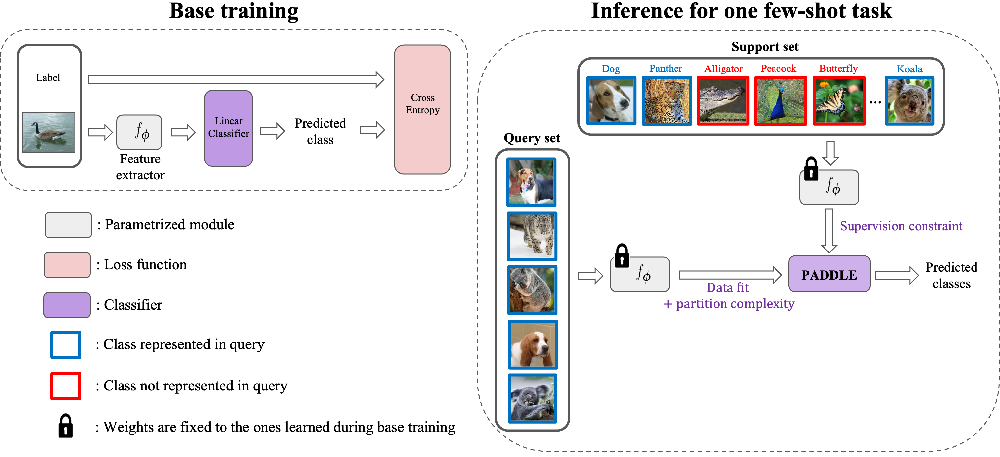

# Towards Practical Few-shot Query Sets: Transductive Minimum Description Length Inference


##  Introduction
This repo contains the code for our NeurIPS 2022 paper "Towards Practical Few-shot Query Sets:
Transductive Minimum Description Length Inference", available at https://arxiv.org/abs/2210.14545. 

It includes our two main contributions:

- the generation of realistic few-shot tasks with a very large number $K$ of ways, and an adjustable number $K_{\mathrm{eff}}$ of classes effectively present in the query set, 

- our classifier PADDLE (see Figure below) as well as all the other methods evaluated in our paper.

Results provided in the paper can be reproduced with this repo. Code was developed under python 3.8 and pytorch 1.12.1.



## 1. Getting started

### 1.1. Requirements

- python 3.8
- pytorch=1.1
- loguru=0.5.3
- matplotlib
- pyyalm
- scikit-learn
- torchvision
- tqdm
- cvxpy

You can create a new conda environment using the .yml file provided.
```bash
conda env create -f paddle_env.yml
```

### 1.2 Download datasets and models
Our framework was developped for the datasets _mini-imagenet_, _tiered-imagenet_ and _iNatural_. We used pre-trained models. 

The downloaded datasets should be placed in the folder data/ the following way:

    .
    ├── ...
    ├── data                    
    │   ├── mini       
    │   ├── tiered        
    │   └── inatural               
    └── ...

The downloaded models should be placed in the folder checkpoints/ the following way:

    .
    ├── ...
    ├── checkpoints                    
    │   ├── mini          
    │   ├── tiered        
    │   └── inatural               
    └── ...

#### 1.2.1 Mini-imagenet and tiered-imagenet

We follow instructions 1.1.1 to 1.1.2 of NeurIPS 2020 paper "TIM: Transductive Information Maximization" [public implementation](https://github.com/mboudiaf/TIM).

For the datasets, please download the zip file [here](https://drive.google.com/drive/folders/163HGKZTvfcxsY96uIF6ILK_6ZmlULf_j?usp=sharing), and unzip it into the data/ folder.

For the corresponding pre-trained models, please download the zip file at [here](https://drive.google.com/file/d/15MFsig6pjXO7vZdo-1znJoXtHv4NY-AF/view?usp=sharing), and unzip it at the root.

#### 1.2.2 Inatural

To download the iNatural dataset for few-shot classification, we follow the instructions 2.4 of the ICML 2020 paper "LaplacianShot: Laplacian Regularized Few Shot Learning" [public implementation](https://github.com/imtiazziko/LaplacianShot). 

From this [link](https://github.com/visipedia/inat_comp/blob/master/2017/README.md#Data), download and unpack the _Training and validation images_ and the _Training bounding box annotations_ to data/inatural directory. 

From this [link](https://github.com/daviswer/fewshotlocal), download _traincatlist.pth_ and _testcatlist.pth_ in the same directory from here. 

Then, run the following to setup the dataset:
 ```bash
cd ./data/iNat
python inatural_setup.py
```

## 2. Running the code and reproducing the main results

Before anything, activate the environment:
```python
conda activate paddle
```
For _mini-imagenet_ and _tiered-imagenet_, and for each method that requiered parameter tuning unlike PADDLE, we tuned the parameters on the validation set, using standard $5$-shot $5$-way tasks. The best parameters were reported in the config files. Since no validation set was provided for the _iNatural_ dataset, we used the parameters tuned on _tiered-imagenet_. 

### 2.1 Table 1 and 2 results in paper

If you want to reproduce the results in the realistic few-shot setting proposed in the paper, on _mini-Imagenet_, for $20$-shots tasks with $K_{\mathrm{eff}} = 5$, using a ResNet-18 and PADDLE classifier, go to the root of the directory and execute:
```python
python3 -m main --opts dataset mini shots [20] k_eff 5 arch resnet18 method paddle 
```
You might also want to directly modify the options in the following config file: config/main_config.yalm

### 2.2 Figures 2 and 3 results in paper

To generate the figures from the provided .txt files in Results/test, run the following command
 ```bash
bash scripts/plot_benchmarks.sh
```
If you wish to reproduce all the results provided in the .txt files, you could use the option save_results in the main config.

### 2.3 Re-tuning the parameters

If you wish to tune the parameters of the methods from zero, you can use and modify scripts/tune_parameters.sh.

# Acknowledgements

Special thanks to the authors of NeurIPS 2020 paper "TIM: Transductive Information Maximization" (TIM) (https://github.com/mboudiaf/TIM) and to the authors of NeurIPS 2021 paper "Realistic evaluation of transductive few-shot learning" (https://github.com/oveilleux/Realistic_Transductive_Few_Shot) for publicly sharing their pre-trained models and their source code from which this repo was inspired from. 


